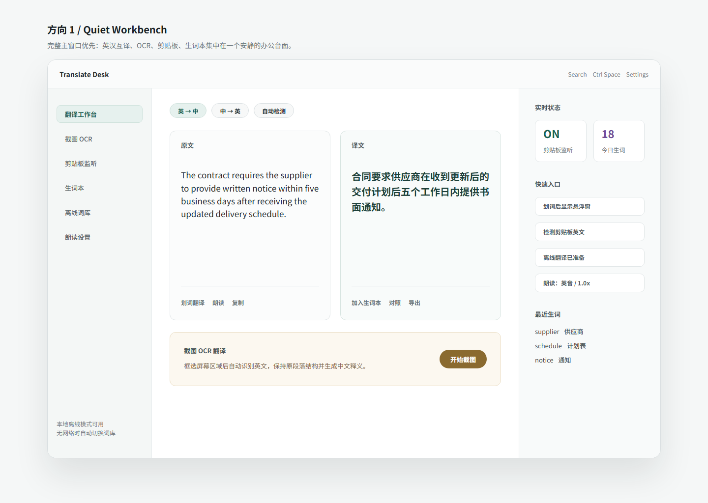

# Translate Desk

> **面向 Windows 办公场景的英汉互译桌面工具。** 主界面保持安静、克制，将真实在线翻译、划词翻译、截图 OCR、剪贴板监听和本地生词本集中在一个轻量工作台中。

[](https://github.com/Felyx-Fu/translate-desk)
[](https://github.com/Felyx-Fu/translate-desk/releases)
[](LICENSE)

---

## 📷 界面预览



---

## ✨ 特性亮点

* 🚀 **真实翻译引擎**：默认接入免费在线翻译 API，可切换到用户自填 API Key 或离线规则回退模式。
* ⚙️ **统一设置中心**：集中配置翻译服务商、API Key、默认方向、自动检测、历史记录和隐私选项。
* 🚀 **极速划词翻译**：在任意 Windows 应用中选中文本，按下 `Ctrl + Space` 即可唤起悬浮翻译窗，即时呈现译文。
* 📸 **截图 OCR 识别**：支持屏幕区域框选，直接提取英文图像中的文字，并保持原段落结构进行翻译。
* 📋 **智能剪贴板监听**：自动捕捉剪贴板中的英文文本，避免频繁复制粘贴，完美契合日常阅读流。
* 📖 **本地化生词本**：翻译历史一键保存到生词本，支持例句记录与朗读复习，数据 100% 本地留存。
* 🔀 **智能方向检测**：无缝支持“英译中”、“中译英”，可开启“自动检测”免去手动切换的烦恼。
* 🔇 **无扰静默运行**：无广告、无弹窗，支持开机自启和后台静默运行，只在需要时出现。

---

## 🔧 模块状态

| 模块 | 当前状态 | 核心说明 |
| :--- | :--- | :--- |
| **双语翻译** | `在线可用` | 默认使用免费在线翻译 API，失败时回退到本地离线规则。 |
| **设置中心** | `基础可用` | 可配置翻译引擎、API Endpoint、API Key、默认方向、历史与隐私选项。 |
| **划词悬浮窗** | `可用原型` | `Ctrl + Space` 快速唤起，自动读取选中文本，回退至剪贴板。 |
| **截图 OCR** | `区域识别` | 基于 `tesseract.js` 实现，支持自主框选区域并自动翻译。 |
| **剪贴板监听** | `可用原型` | 监听长度大于 6 字符的英文并归档，保护剪贴板隐私。 |
| **离线词库** | `部分可用` | 预设基础商务词库，完全断网状态下也能使用基础翻译。 |
| **生词本** | `本地持久` | 保存到 Electron `userData` 目录，无多端同步风险。 |
| **朗读功能** | `系统合成` | 使用系统 Web Speech API，可试听并配置语速和音色。 |

---

## 📥 下载与安装

Windows 预编译可执行文件在项目的 **[GitHub Releases](https://github.com/Felyx-Fu/translate-desk/releases)** 页面中发布。

1. 进入 **[Releases 页面](https://github.com/Felyx-Fu/translate-desk/releases)** 下载最新版 `Translate.Desk-X.Y.Z-win-x64-portable.exe`。
2. 下载后直接双击运行即可，无需安装，绿色免安装。
3. 如果下载的是历史版本的 `.zip` 压缩包，请先解压到任意本地目录，再运行 `Translate Desk.exe`。

---

## 💻 本地运行与构建

本项目基于 **TypeScript**, **React**, **Vite** 和 **Electron** 构建。

### 开发环境准备
```powershell
# 克隆仓库
git clone https://github.com/Felyx-Fu/translate-desk.git
cd translate-desk

# 安装依赖
npm install
```

### 运行开发服务器
```powershell
# 启动热重载开发服务器与 Electron 窗口
npm run desktop
```

### 本地构建预览
```powershell
# 编译并启动生产包预览
npm run desktop:preview
```

### 打包发布产物
```powershell
# 打包生成 Windows 便携式 exe 文件 (输出到 release/ 目录)
npm run dist:win
```

---

## 🎯 路线图 (Roadmap)

* [x] **v0.4.1**：提供 `.exe` 后缀的单文件 Windows 绿色便携包，降低用户上手成本。
* [ ] **v0.5.0**：完善真实翻译引擎、设置中心、翻译失败提示和历史记录。
* [ ] **v0.6.0**：完善生词本复习系统（引入艾宾浩斯记忆提醒、导出 CSV/Anki 卡片）。
* [ ] **v0.7.0**：引入主流云端大模型翻译引擎接口，供用户自主配置 API Key 以获取精细译文。
* [ ] **v0.8.0**：评估并迁移至 Rust/Tauri 架构，以将安装包体积缩减至 10MB 以内，并降低内存占用。

---

## 🔒 隐私与安全声明

我们极其重视您的数据隐私，Translate Desk 的设计原则是 **Local-First (本地优先)**：
1. **本地优先**：剪贴板监听、外部选中文本读取、截图 OCR 识别和生词本保存默认在本机处理。
2. **在线翻译边界**：启用在线翻译时，待翻译文本会发送到设置中心选择的翻译服务商。
3. **数据存储透明**：生词本保存于 Electron `userData` 目录；设置项保存在本地浏览器存储中。

更完整的说明见 [PRIVACY.md](PRIVACY.md)。

---

## 📄 开源协议

本项目采用 [MIT License](LICENSE) 开源协议。
